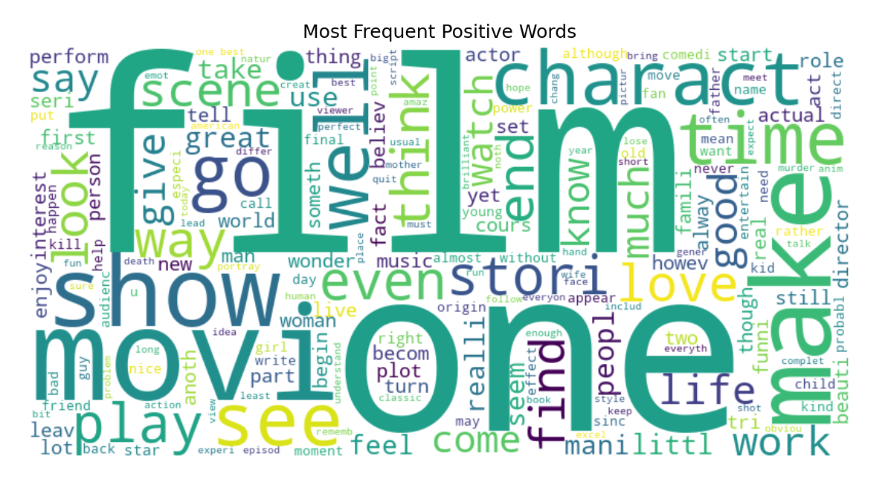
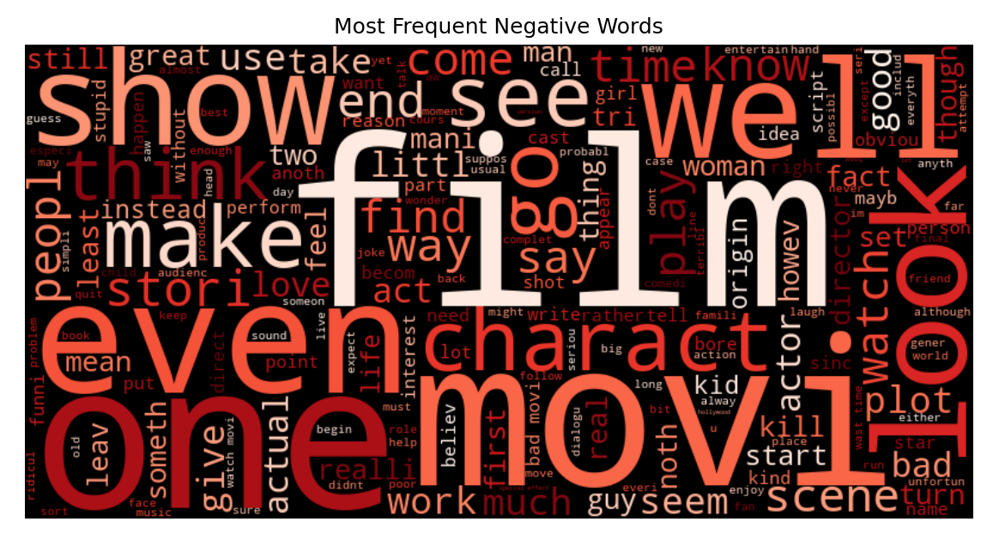
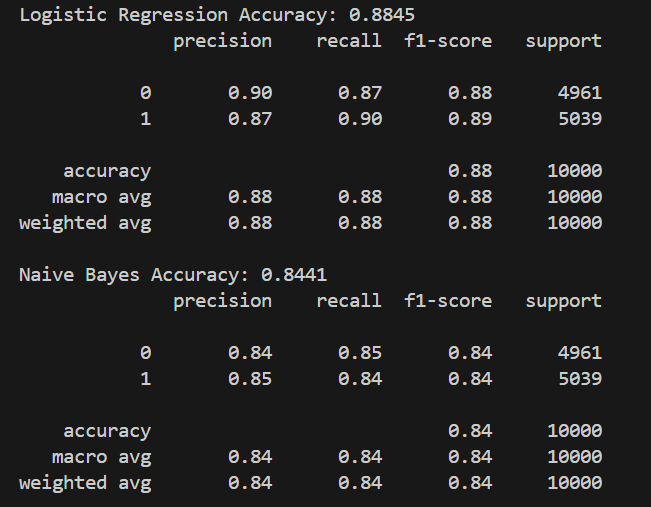

# Sentiment-Analysis-on-Movie-Reviews
This project analyzes IMDb movie reviews to classify sentiments as positive or negative. It includes text preprocessing, feature extraction using TF-IDF and CountVectorizer, training Logistic Regression and Naive Bayes classifiers, and visualizing frequent words with WordClouds.

This project performs sentiment analysis on IMDb movie reviews to classify them as positive or negative using machine learning techniques.

## Features
- Text preprocessing: cleaning, tokenization, stopwords removal, lemmatization, and stemming
- Feature extraction: TF-IDF and CountVectorizer
- Classification models: Logistic Regression and Naive Bayes
- Evaluation using accuracy and classification reports
- WordCloud visualization of the most frequent positive and negative words

## Requirements
- Python 3.x
- pandas
- nltk
- scikit-learn
- matplotlib
- wordcloud

## Installation

1. Clone the repository or download the script.

2. Install the required Python packages:

```bash
pip install pandas nltk scikit-learn matplotlib wordcloud
```
3. Download necessary NLTK datasets (the script includes this, but you can also run separately):

```python
import nltk
nltk.download('punkt')
nltk.download('stopwords')
nltk.download('wordnet')
nltk.download('averaged_perceptron_tagger')
```
## Usage

1. Place the IMDb dataset CSV file (e.g., IMDB Dataset.csv) on your machine.

2. Open the Python script and update the dataset file path in the code:

```python
df = pd.read_csv(r"YOUR_DATASET_FILE_PATH_HERE")
```
3. Run the script. It will:
- Preprocess the reviews
- Vectorize text using TF-IDF and CountVectorizer
- Train Logistic Regression and Naive Bayes classifiers
- Output accuracy and classification reports
- Generate WordCloud visualizations for positive and negative reviews

## Notes

- Make sure the file path to the dataset matches the location on your computer.
- You can adjust vectorizer parameters or classifiers as needed for experimentation.

## Results

## WordClouds
  ### positive Words

  ### Nigative Words


## Model Accuracy



## License

This project is open source and available under the MIT License.


